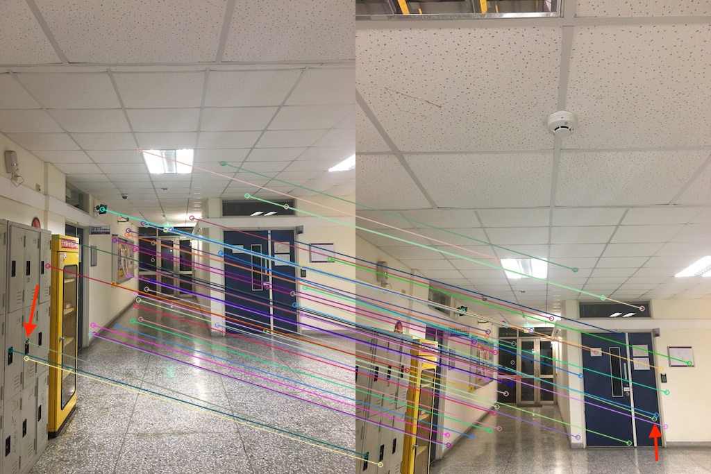
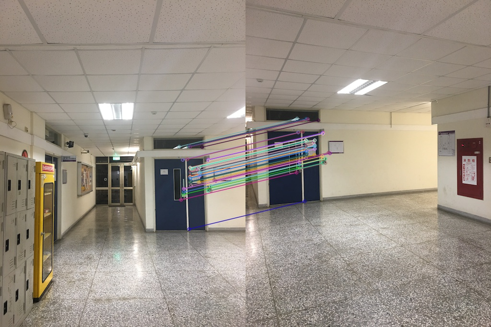

# Infinite Zooming
Homework4 of NTHU CVFX. Feature matching for moving forward and infinite zooming effect.

- V (5%)Take a sequence of moving-forward images in NTHU campus.
- V (5%)Show feature extraction and matching results between two images
- (20%)implement different feature extrators, e.g. SIFT, SURF, and compare the results
    - Make summary
- (10%)Perform image alignment and generate infinite zooming effect
- (10%)exploit creativity to add some image processing to enhance effect. You can use photoshop to do some effects, such as bluring or coloring.

## Part 1: Feature Detector Comparison

### 1.1 Benchmark preparation
In below, we will use 4 types of input images to compare the results. The 4 types are depicted in below 4 columns:

|      | Moving forward | Pitch rotation | Roll rotation | Yaw rotation |
| :--: | :------------: | :------------: | :-----------: | :----------: |
| img1 |  |  |  | 
| img2 |  |  |  |  |

Among the 4 types, the source image are all the same but the target images for feature matching are taken such that they micmic the camera *moving forward, pitch rotation, roll rotation, yaw rotation* respectively.

### 1.2 Comparing different detectors and matching algorithms setting
The source codes generating all the below results is `feature_matcher.py`. We draw 50 matched features with the lowest distance for easier comparing the results by human eyes.

#### Case: Moving forward
| | Brute Force Matching w/ Cross Check | Brute Force Matching w/ Ratio Test |
| :--: | :------------------: | :-----------------: |
| SIFT |  |  |
| SURF |  |  |
| SURF extended |  |  |
| ORB |  |  |

#### Case: Pitch rotation
| | Brute Force Matching w/ Cross Check | Brute Force Matching w/ Ratio Test |
| :--: | :------------------: | :-----------------: |
| SIFT |  |  |
| SURF |  |  |
| SURF extended |  |  |
| ORB |  |  |

#### Case: Roll rotation
| | Brute Force Matching w/ Cross Check | Brute Force Matching w/ Ratio Test |
| :--: | :------------------: | :-----------------: |
| SIFT |  |  |
| SURF |  |  |
| SURF extended |  |  |
| ORB |  |  |

#### Case: Yaw rotation
| | Brute Force Matching w/ Cross Check | Brute Force Matching w/ Ratio Test |
| :--: | :------------------: | :-----------------: |
| SIFT |  |  |
| SURF |  |  |
| SURF extended |  |  |
| ORB |  |  |

### 1.3 The effect after homography estimation
In many applications like panoram stitching and pose estimation, the matched keypoints is used to estimate the homography[[ref]](https://ags.cs.uni-kl.de/fileadmin/inf_ags/3dcv-ws11-12/3DCV_WS11-12_lec04.pdf) between the two images. In cases that the two images are captured only with different camera rotation and no camera translation, RANSAC can be applied to estimate the homography and remove false matched feature (see below figure).

However, if the two images are captured with different camera translation, only features on the same plane are guaranteed to match. In below example, most of the matched features are located on the farest door. So after the homography estimation, the matched features closer to the camera are considered as mis-match. Some of them are really incorrect match (indicated as red) but it also remove some original correct match (indicated as green).

| Before | After |
| :---------------------: | :--------------------: |
|  |  |
