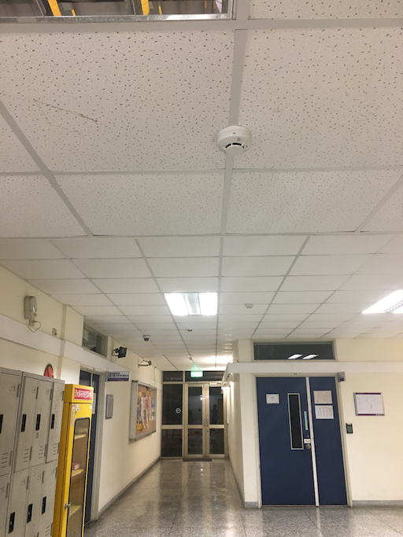
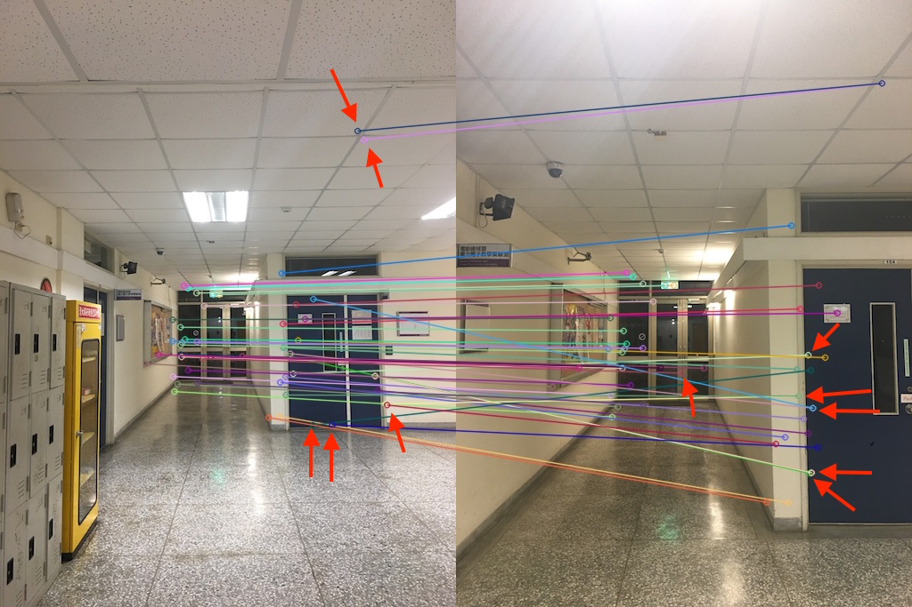
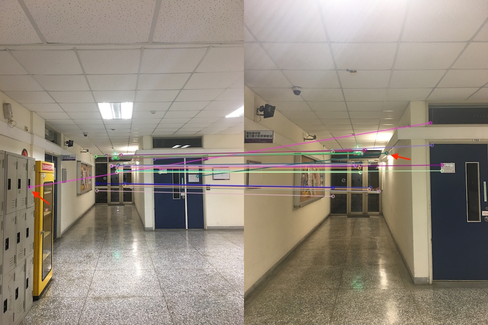
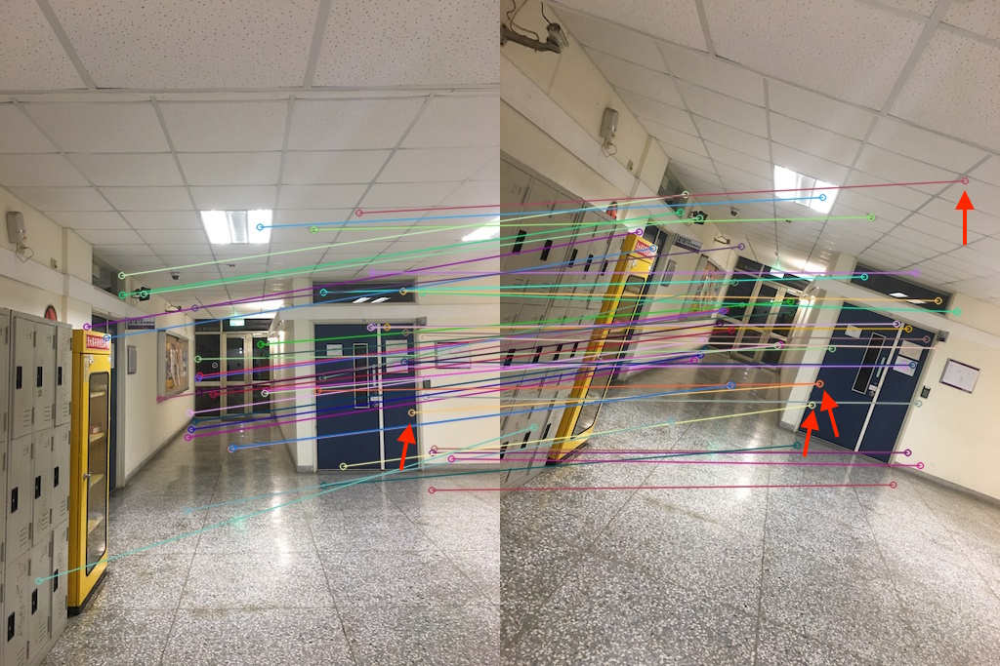
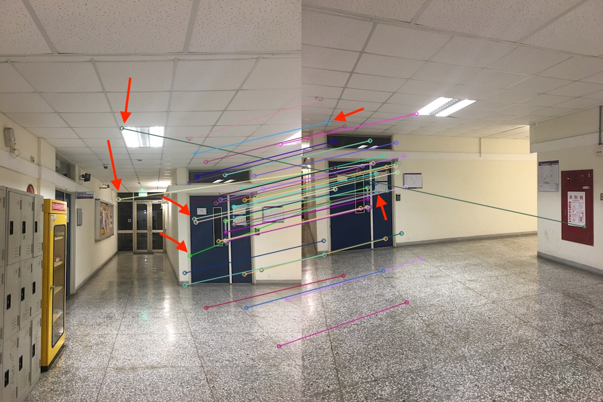

# Infinite Zooming
Homework4 of NTHU CVFX. Feature matching for moving forward and infinite zooming effect.

## Part 1: Feature Detector Comparison

### 1.1 Benchmark preparation
In below, we will use 4 types of input images to compare the results. The 4 types are depicted in below 4 columns:

|      | Moving forward | Pitch rotation | Roll rotation | Yaw rotation |
| :--: | :------------: | :------------: | :-----------: | :----------: |
| img1 |  |  |  | 
| img2 |  |  |  |  |

Among the 4 types, the source image are all the same but the target images for feature matching are taken such that they micmic the camera *moving forward, pitch rotation, roll rotation, yaw rotation* respectively.

### 1.2 Comparing different detectors and matching algorithms setting
The source codes generating all the below results is `feature_matcher.py`. We draw 50 matched features with the lowest distance for easier comparing the results by human eyes.

We compare between 4 feature descriptors:
- SIFT
- SURF
- SURF extended (128 dimensions instead of 64)
- ORB

and 2 matching algorithm settings:
- Brute Force Matching w/ Cross Check
	- only accept those matches with value (i,j) such that i-th descriptor in set A has j-th descriptor in set B as the best match and vice-versa.
- Brute Force Matching w/ Ratio Test
	- for each descriptor, find two closest neighbors.
	- a descriptor is a match for its closest neighbor if the ratio of the distance of the closest neighbor to the distance of the second-closest neighbor is lower than a threshold.
	- we set the ratio threshold to 0.7

#### Case: Moving forward
| | Brute Force Matching w/ Cross Check | Brute Force Matching w/ Ratio Test |
| :--: | :------------------: | :-----------------: |
| SIFT |  |  |
| SURF |  |  |
| SURF extended |  |  |
| ORB |  |  |

#### Case: Pitch rotation
| | Brute Force Matching w/ Cross Check | Brute Force Matching w/ Ratio Test |
| :--: | :------------------: | :-----------------: |
| SIFT |  |  |
| SURF |  |  |
| SURF extended |  |  |
| ORB |  |  |

#### Case: Roll rotation
| | Brute Force Matching w/ Cross Check | Brute Force Matching w/ Ratio Test |
| :--: | :------------------: | :-----------------: |
| SIFT |  |  |
| SURF |  |  |
| SURF extended |  |  |
| ORB |  |  |

#### Case: Yaw rotation
| | Brute Force Matching w/ Cross Check | Brute Force Matching w/ Ratio Test |
| :--: | :------------------: | :-----------------: |
| SIFT |  |  |
| SURF |  |  |
| SURF extended |  |  |
| ORB |  |  |

#### Discussion
- In general, ratio test works better than cross check in our experiment.
- ORB descripter works the best under all experiment settings.
- The results of SURF (64 dim) and SURF extended (128 dim) are similar.
- The effectiveness of the 4 descriptors under our experiment is: ORB > SIFT > SURF = SURF extended.

### 1.3 The effect after homography estimation
In many applications like panoram stitching and pose estimation, the matched keypoints is used to estimate the homography[[ref]](https://ags.cs.uni-kl.de/fileadmin/inf_ags/3dcv-ws11-12/3DCV_WS11-12_lec04.pdf) between the two images. In cases that the two images are captured only with different camera rotation and no camera translation, RANSAC can be applied to estimate the homography and remove false matched feature (see below figure).

However, if the two images are captured with different camera translation, only features on the same plane are guaranteed to match. In below example, most of the matched features are located on the farthest door. So after the homography estimation, the matched features closer to the camera are considered as mis-match. Some of them are really incorrect match (indicated as red) but it also remove some original correct match (indicated as green).

| Before | After |
| :---------------------: | :--------------------: |
|  |  |

## Part 2: Moving Forward Effect from a Sequence of Images
To generate the moving forward effect from order images, we pick the first image as background and add image one by one as the camera move forward. The new image is scaled smaller and aligned with the previous one such that prominent feature are aligned. Below figure shows the result aligned by the estimated homography between two image:

|  |  |  |
| :-: | :-: | :-: |
|  |  |  |

Finally, the exposure of each image is tuned respectively such that the result look more pleasing.

